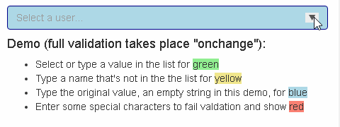

# knockout-color-validation-demo

This is a demonstration of a validated combo box behavior using 
__HTML `<datalist>` element__ and __[Knockout](https://knockoutjs.com/)__.

## Live Demo

See this [JSFiddle](https://jsfiddle.net/tdreid/roq5eza6/embedded/#Result) 
for a quick working example of the knockout binding.

## Installation

The demo is a complete ASP.Net MVC site that 
___requires .Net Framework 4.7.2 or later___.

1. Clone this repo

2. Open `knockout-color-validation-demo.sln` in 
Visual Studio (2017 or later recommended.)

3. <kbd>F5</kbd> to run.

Optionally [publish and deploy](https://docs.microsoft.com/en-us/visualstudio/deployment/quickstart-deploy-to-a-web-site?view=vs-2017) 
to a web server.

## Acknowledgment and Reference

This work is inspired by and extends a Knockout datalist custom binding 
advanced [on Stack Overflow](https://stackoverflow.com/questions/19865364/knockoutjs-linking-value-from-a-input-to-a-datalist-value) 
by [Tomalak](https://stackoverflow.com/users/18771/tomalak).

## License

[MIT License](https://choosealicense.com/licenses/mit/)

Copyright (c) 2019 Trevor Reid

Permission is hereby granted, free of charge, to any person obtaining a copy
of this software and associated documentation files (the "Software"), to deal
in the Software without restriction, including without limitation the rights
to use, copy, modify, merge, publish, distribute, sublicense, and/or sell
copies of the Software, and to permit persons to whom the Software is
furnished to do so, subject to the following conditions:

The above copyright notice and this permission notice shall be included in all
copies or substantial portions of the Software.

THE SOFTWARE IS PROVIDED "AS IS", WITHOUT WARRANTY OF ANY KIND, EXPRESS OR
IMPLIED, INCLUDING BUT NOT LIMITED TO THE WARRANTIES OF MERCHANTABILITY,
FITNESS FOR A PARTICULAR PURPOSE AND NONINFRINGEMENT. IN NO EVENT SHALL THE
AUTHORS OR COPYRIGHT HOLDERS BE LIABLE FOR ANY CLAIM, DAMAGES OR OTHER
LIABILITY, WHETHER IN AN ACTION OF CONTRACT, TORT OR OTHERWISE, ARISING FROM,
OUT OF OR IN CONNECTION WITH THE SOFTWARE OR THE USE OR OTHER DEALINGS IN THE
SOFTWARE.
